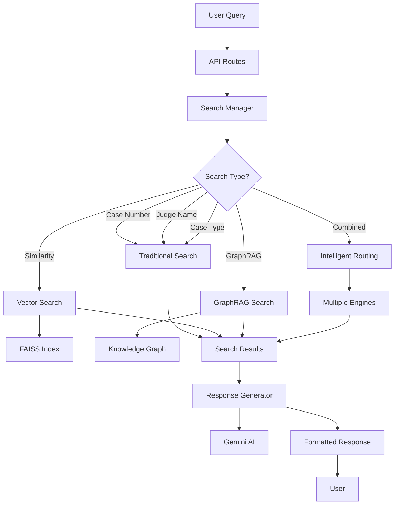

# 🏗️ Architecture Documentation

## 📁 Project Structure

```
AI-Chatbot-GraphRAG/
├── 🎯 main.py                     # Application entry point
├── 🔧 run_dev.py                  # Development startup script
├── ⚙️ src/                        # Source code modules
│   ├── 📝 __init__.py
│   ├── ⚙️ config.py               # Configuration management
│   ├── 🔍 search/                 # Search engines
│   │   ├── 📝 __init__.py
│   │   ├── 🔢 vector_search.py    # FAISS vector search
│   │   ├── 🔍 traditional_search.py # Exact match search
│   │   ├── 🕸️ graphrag_search.py  # GraphRAG search
│   │   └── 🎯 search_manager.py   # Search coordinator
│   ├── 🤖 ai/                     # AI response generation
│   │   ├── 📝 __init__.py
│   │   └── 💬 response_generator.py
│   ├── 📊 models/                 # Data models & schemas
│   │   ├── 📝 __init__.py
│   │   ├── 🏷️ enums.py
│   │   └── 📋 schemas.py
│   ├── ⚡ api/                     # FastAPI routes
│   │   ├── 📝 __init__.py
│   │   └── 🛣️ routes.py
│   ├── 🔄 processing/             # Text processing
│   │   ├── 📝 __init__.py
│   │   ├── 📝 text_utils.py       # Text utilities
│   │   ├── ⚖️ legal_utils.py      # Legal-specific processing
│   │   └── 📂 data_loader.py      # Document loading
│   ├── 🕸️ graphrag/               # GraphRAG implementation
│   │   ├── 📝 __init__.py
│   │   ├── 🗺️ knowledge_graph.py  # Knowledge graph
│   │   └── 🔍 graph_retriever.py  # Graph retrieval
│   └── 🛠️ utils/                  # Utility functions
│       └── 📝 __init__.py
├── ⚛️ src/components/              # React frontend
│   ├── 💬 ChatInterface.jsx
│   ├── 📝 ChatMessage.jsx
│   └── ⏳ TypingIndicator.jsx
├── 📊 data/                       # Data storage
│   ├── 🔢 embeddings/             # Vector embeddings
│   └── 🕸️ graphs/                 # Knowledge graphs
├── 📁 json_cases/                 # Legal case data
├── 📋 requirements.txt            # Python dependencies
├── 📦 package.json                # Node.js dependencies
├── ⚙️ vite.config.js              # Vite configuration
├── 🌍 .env                        # Environment variables
└── 📚 README.md                   # Documentation
```

## 🧩 Module Breakdown

### 🔧 Core Configuration (`src/config.py`)
- **Purpose**: Central configuration management
- **Features**:
  - Environment variable loading
  - Configuration validation
  - Default values
  - Computed properties for file paths

### 🔍 Search System (`src/search/`)

#### 📊 Vector Search Engine (`vector_search.py`)
- **Purpose**: FAISS-based semantic similarity search
- **Features**:
  - Document embedding generation
  - FAISS index creation and management
  - Similarity threshold filtering
  - Batch processing for efficiency

#### 🔍 Traditional Search Engine (`traditional_search.py`)
- **Purpose**: Exact match search strategies
- **Features**:
  - Case number pattern matching
  - Judge name fuzzy matching
  - Case type filtering
  - Text normalization

#### 🕸️ GraphRAG Search Engine (`graphrag_search.py`)
- **Purpose**: Knowledge graph-enhanced search
- **Features**:
  - Graph traversal algorithms
  - Community detection integration
  - Context enhancement
  - Relationship analysis

#### 🎯 Search Manager (`search_manager.py`)
- **Purpose**: Coordinates all search strategies
- **Features**:
  - Intelligent search routing
  - Combined search strategies
  - Result aggregation
  - Performance optimization

### 🤖 AI System (`src/ai/`)

#### 💬 Response Generator (`response_generator.py`)
- **Purpose**: AI-powered response generation
- **Features**:
  - Google Gemini integration
  - Legal query validation
  - Context-aware responses
  - Structured output formatting

### 📊 Data Models (`src/models/`)

#### 🏷️ Enums (`enums.py`)
- Search types (SIMILARITY, CASE_NUMBER, JUDGE, etc.)
- Case types (อาญา, แพ่ง, แรงงาน, etc.)

#### 📋 Schemas (`schemas.py`)
- Pydantic models for API requests
- Type validation
- Documentation generation

### ⚡ API Layer (`src/api/`)

#### 🛣️ Routes (`routes.py`)
- **Purpose**: FastAPI endpoint definitions
- **Endpoints**:
  - `/chat` - AI conversation
  - `/search` - Advanced search
  - `/search/case/{id}` - Case lookup
  - `/info/*` - System information
  - `/graph/stats` - Graph statistics

### 🔄 Text Processing (`src/processing/`)

#### 📝 Text Utilities (`text_utils.py`)
- Unicode normalization
- Text cleaning and chunking
- Keyword extraction
- Judge name processing

#### ⚖️ Legal Utilities (`legal_utils.py`)
- Case type detection
- Legal concept extraction
- Thai legal pattern matching

#### 📂 Data Loader (`data_loader.py`)
- JSON file processing
- Document chunking
- Metadata extraction

## 🔄 Data Flow



## 🚀 Startup Process

1. **Configuration Loading** (`config.py`)
   - Load environment variables
   - Validate required settings
   - Set up file paths

2. **Search Engine Initialization** (`search_manager.py`)
   - Initialize vector search engine
   - Load or create FAISS index
   - Build knowledge graph
   - Set up traditional search

3. **API Server Startup** (`main.py`)
   - Create FastAPI application
   - Configure middleware
   - Include route handlers
   - Start uvicorn server

## 📈 Performance Optimizations

### 🔢 Vector Search
- **FAISS IVF Index**: Fast similarity search for large datasets
- **Batch Embedding**: Process multiple documents simultaneously
- **Index Caching**: Persistent storage for quick startup

### 🕸️ Knowledge Graph
- **Community Detection**: Reduce search space through clustering
- **Graph Caching**: Serialize graph structures for reuse
- **Relationship Pruning**: Focus on high-relevance connections

### 🔄 Text Processing
- **Chunking Strategy**: Overlap-based document splitting
- **Thai Normalization**: Optimized Unicode handling
- **Keyword Caching**: Pre-computed legal term extraction

## 🔌 Extension Points

### Adding New Search Types
1. Extend `SearchType` enum in `models/enums.py`
2. Implement search logic in appropriate engine
3. Update routing in `search_manager.py`
4. Add API endpoint in `api/routes.py`

### Adding New Data Sources
1. Create processor in `processing/`
2. Update `data_loader.py` for new formats
3. Modify graph building in `graphrag/knowledge_graph.py`

### Enhancing AI Responses
1. Modify prompt templates in `ai/response_generator.py`
2. Add new response formatting functions
3. Integrate additional AI models

## 🛡️ Security Considerations

- **Environment Variables**: Secure API key management
- **Input Validation**: Pydantic schema validation
- **Query Filtering**: Legal relevance checking
- **Rate Limiting**: Can be added to API routes

## 🧪 Testing Strategy

- **Unit Tests**: Individual module testing
- **Integration Tests**: Search pipeline testing  
- **API Tests**: Endpoint validation
- **Performance Tests**: Load and speed testing

## 📚 Dependencies

### 🐍 Python Core
- `fastapi` - Web framework
- `uvicorn` - ASGI server
- `pydantic` - Data validation

### 🔍 Search & AI
- `faiss-cpu` - Vector similarity search
- `sentence-transformers` - Text embeddings
- `google-generativeai` - Gemini AI

### 📊 Graph & Processing
- `networkx` - Graph processing
- `community` - Community detection
- `numpy` - Numerical computing

### ⚛️ Frontend
- `react` - UI framework
- `@mui/material` - Component library
- `framer-motion` - Animations

---

This modular architecture provides:
- ✅ **Separation of Concerns**: Each module has a specific responsibility
- ✅ **Scalability**: Easy to add new features and engines
- ✅ **Maintainability**: Clear code organization and dependencies
- ✅ **Testability**: Isolated components for unit testing
- ✅ **Performance**: Optimized for large-scale legal data processing